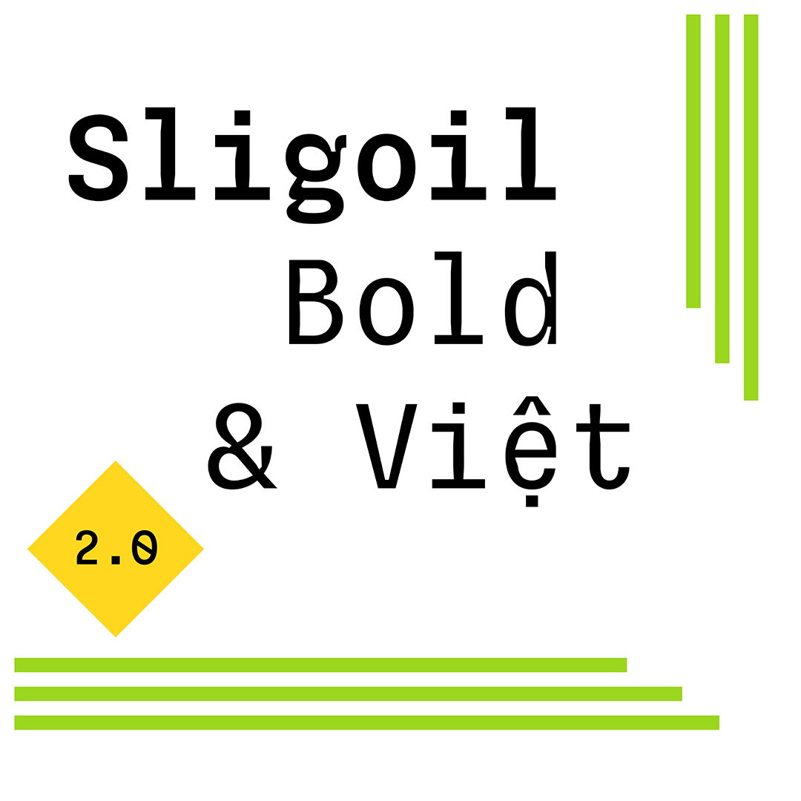
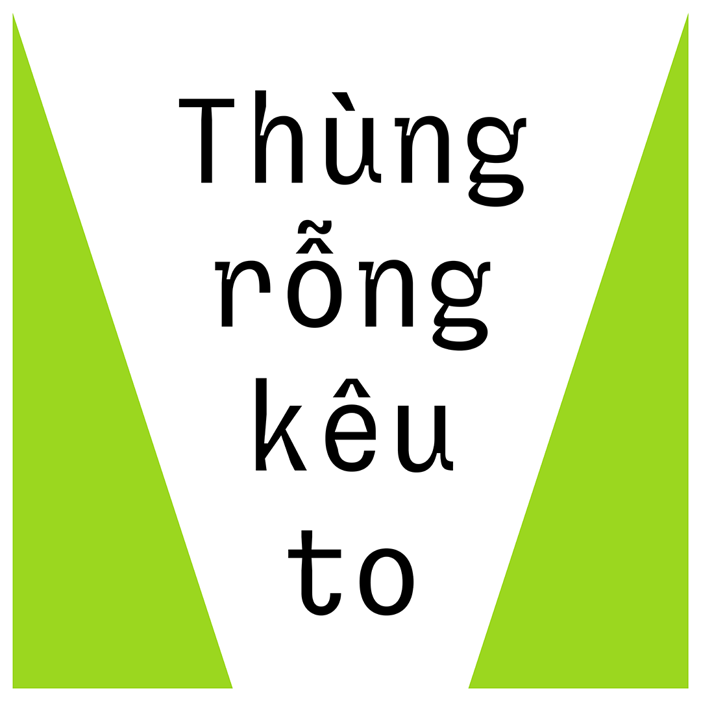
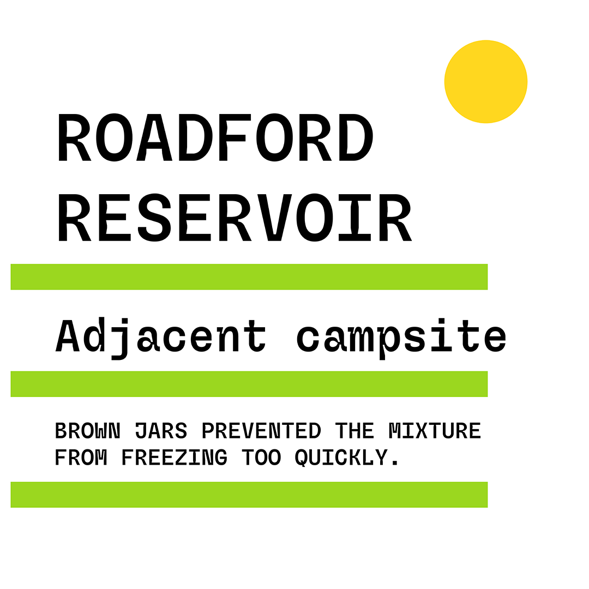
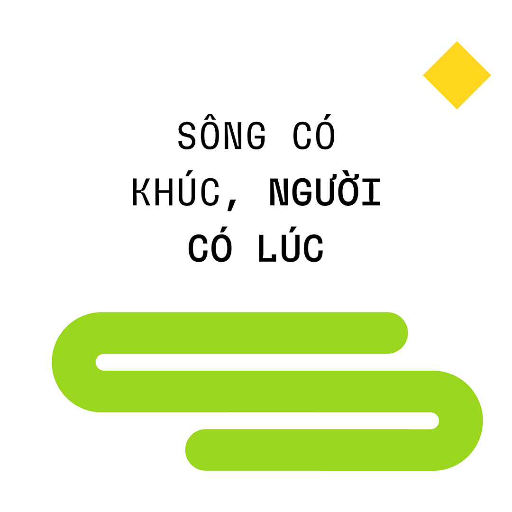
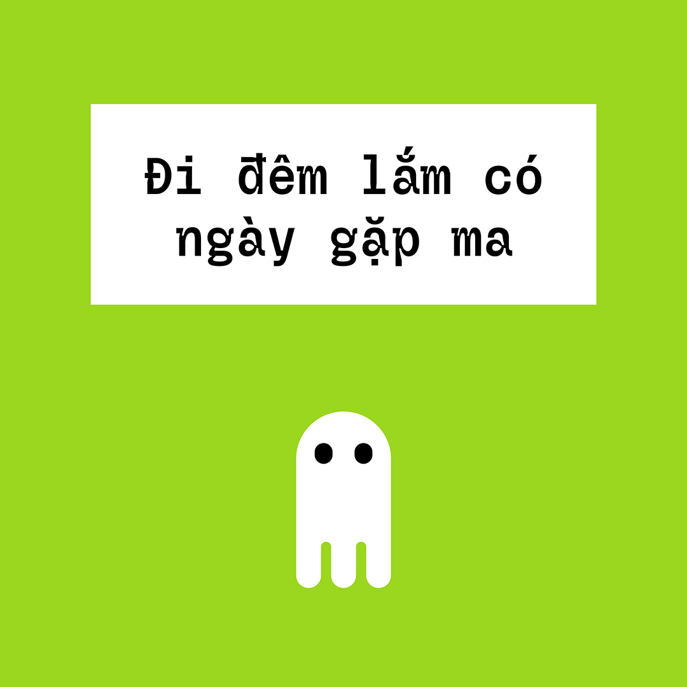
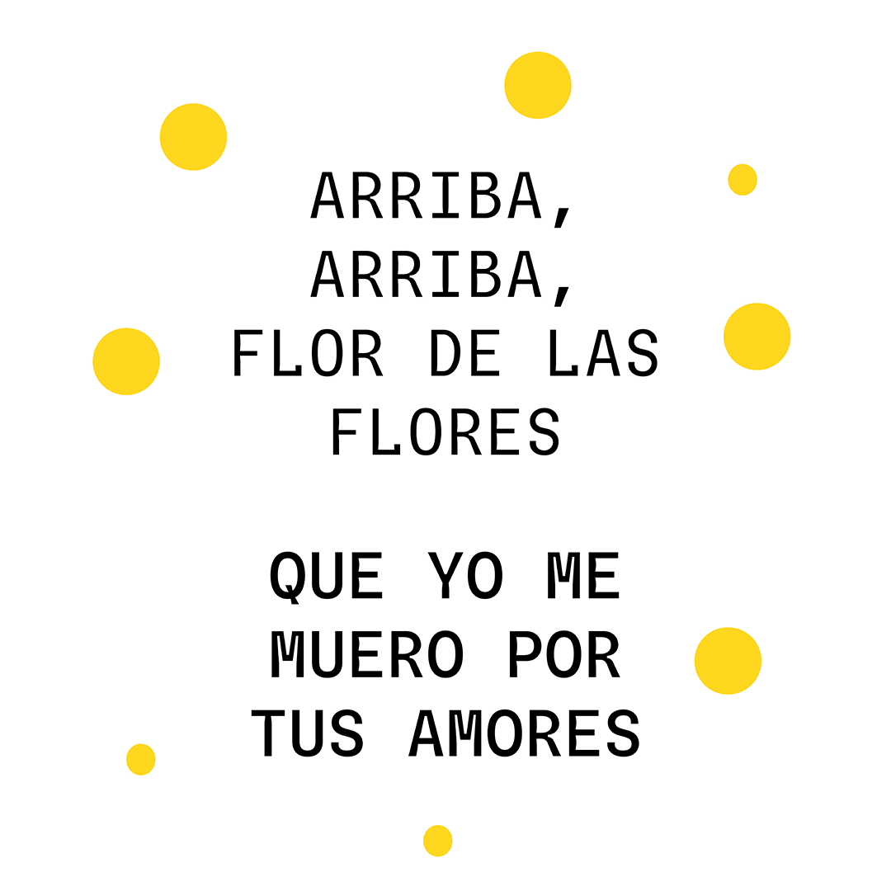

# Sligoil

<strong>[EN]</strong>

Sligoil is a monospace typeface. It has been designed for the interface of the Unknown Number game, nowadays distributed by [Meaning Machine Games](https://www.meaningmachine.games/). "Sligoil" is also the name of an evil fictional company within the game.

The Sligoil typeface has been influenced by the culture of the British isles (the work of Matthew Carter, of course, but also signs on Irish whiskey distilleries) and also by the letters on vintage Space Cadet keyboards (produced by the MIT). It presents wide language support for Latin-based European languages and a collection of symbols and alternate forms  (including upright italic letters).

In June 2025, after three years of research, a new version of Sligoil was published. This new version contains language support for Vietnamese, developed by type designer Đông Trúc Nguyễn (https://www.instagram.com/do_ngtruc/), and two additional styles (Micro Medium and Micro Bold).

Sligoil has been created by Ariel Martín Pérez (https://www.tainome.com - contact@tainome.com) and released under the SIL Open Font Licence 1.1 in 2022. Sligoil is distributed by Velvetyne Type Foundry (http://velvetyne.fr/).

To know how to use this typeface, please read the FAQ (http://velvetyne.fr/about/faq/)

<strong>[FR]</strong>

Sligoil est un caractère typographique à chasse fixe. Il a été dessiné pour l'interface du jeu Unknown Number, aujourd'hui distribué par [Meaning Machine Games](https://www.meaningmachine.games/). "Sligoil" est aussi le nom d'une entreprise maléfique fictive dans le dit jeu.

Le caractère Sligoil a été influencé par la culture des Îles Britanniques (le travail de Matthew Carter, bien évidemment, mais aussi les signes des distilleries de whiskey irlandaises), ainsi que par les lettres sur les anciens claviers Space Cadet (produits par le MIT). Il présente un support linguistique étendu pour les langues européennes basées sur l'alphabet latin, ainsi qu'une collection de symbole et de formes alternatives (incluant des lettres italiques droites).

En juin 2025, après trois années de recherche, une nouvelle version de Sligoil a été publiée. Cette nouvelle version contient du support linguistique pour le vietnamien, développé par la dessinatrice de caractères Đông Trúc Nguyễn (https://www.instagram.com/do_ngtruc/), et deux styles supplémentaires (Micro Medium et Micro Bold).

Sligoil a été créé par Ariel Martín Pérez (https://www.tainome.com - contact@tainome.com) et publié sous la licence SIL Open Font License 1.1 en 2022. Sligoil est distribué par Velvetyne Type Foundry (http://velvetyne.fr/).

Pour savoir comment utiliser cette fonte, veuillez lire la FAQ (http://velvetyne.fr/about/faq/)

<strong>[ES]</strong>

Sligoil es un tipo de letra monoespaciado. Ha sido creado para la interfaz del videojuego Unknown Number, hoy distribuido por [Meaning Machine Games](https://www.meaningmachine.games/). "Sligoil" también es el nombre de una empresa maléfica ficticia en el dicho juego.

El tipo de letra Sligoil ha sido influenciado por la cultura de las Islas Británicas (el trabajo de Matthew Carter, evidentemente, pero también las señales en las destilerías de whisky irlandesas), al igual que por las letras de los antiguos teclados Space Cadet (producidos por el MIT). Presenta un soporte lingüístico amplio que cubre todos los idiomas europeos basados en el alfabeto latino, así como una colección de símbolos y algunas formas de letras alternativas (incluyendo letras cursivas rectas).

En junio de 2025, después de tres años de investigación, una nueva versión de Sligoil fue publicada. Esta nueva version contiene soporte lingüístico para el idioma Vietnamita, desarrollado por la diseñadora tipográfica Đông Trúc Nguyễn (https://www.instagram.com/do_ngtruc/), y dos estilos suplementarios (Micro Medium y Micro Bold).

Sligoil ha sido creado por Ariel Martín Pérez ((https://www.tainome.com - contact@tainome.com) y publicado bajo la licencia SIL Open Font License 1.1 en 2022. Sligoil es distribuido por Velvetyne Type Foundry (http://velvetyne.fr/).

Para saber cómo usar este tipo de letra, lea las preguntas frecuentes (http://velvetyne.fr/about/faq/)

## Specimen

## License

Sligoil is licensed under the SIL Open Font License, Version 1.1.
This license is copied below, and is also available with a FAQ at
http://scripts.sil.org/OFL

## Repository Layout

This font repository follows the Unified Font Repository v2.0,
a standard way to organize font project source files. Learn more at
https://github.com/unified-font-repository/Unified-Font-Repository
